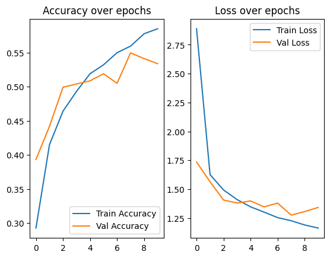
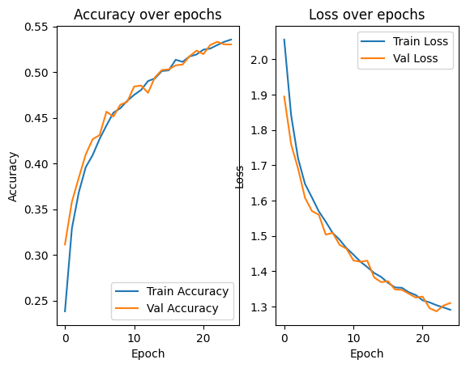
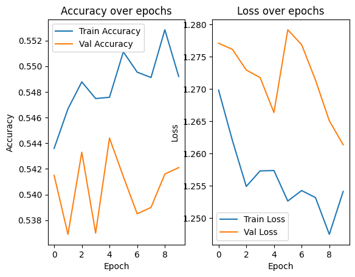
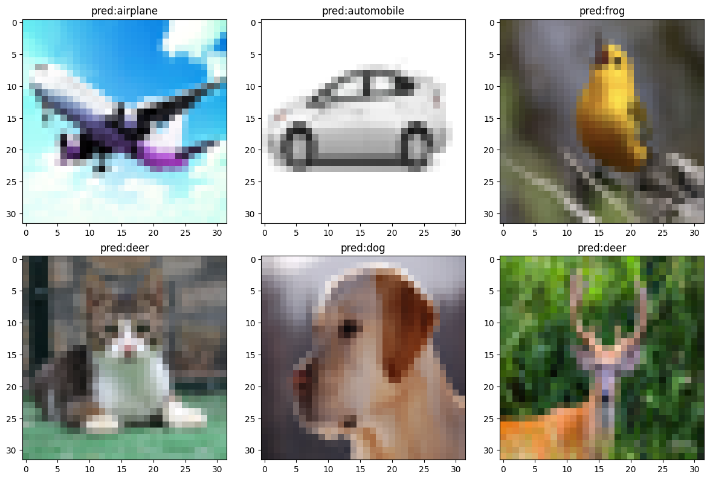

# CIFAR-10 Classification with CNN (Baseline to Improved)

This project demonstrates image classification on the **CIFAR-10 dataset** using custom-built CNN models. The task involves classifying 32x32 RGB images into one of 10 categories, including airplane, automobile, cat, dog, deer, etc.

We track model evolution over three training phases, showing performance improvement and generalization via prediction samples.

---

## 📁 Files Included

* `module.ipynb`: Main notebook containing model training and evaluation
* `test_urls.csv`: Sample image URLs used for testing
* `first_fit_results.png`: Performance of the baseline model
* `second_fit_results.png`: Performance after adding more layers and epochs
* `third_fit_results.png`: Final model training results
* `v1.png`, `v2.png`: Model predictions on unseen test images

---

## 🎨 Model Evolution Summary

### ✅ Phase 1: Baseline CNN

* Shallow model with 2 Conv layers
* Limited capacity
* Accuracy reached \~57% on validation

---

### ✅ Phase 2: Deeper Architecture + More Epochs

* More Conv2D layers
* 25+ epochs
* Accuracy improved and training matched validation

---

### ✅ Phase 3: Further fine-tuning

* Slightly deeper model
* Better optimizer setup
* Final accuracy \~54%+ (due to fluctuations in specific runs)

---

## 🔍 Evaluation on Test Samples

We used external images (via `test_urls.csv`) and visualized the model's predictions.

### Sample Output 1

### Sample Output 2

> Prediction labels (e.g., "pred\:truck", "pred\:dog") show that the model can correctly classify some categories, but still struggles with finer details (e.g., cat vs deer).

---

## 📊 Observations

* Validation accuracy improved significantly between versions
* Still some instability (e.g., accuracy plateaus, minor overfitting)
* Confusion between classes with visual similarity

---

## 🚫 Limitations

* Model struggles on small/fine-featured classes (like bird, cat)
* No augmentation or transfer learning yet
* Accuracy \~55% is below SOTA

---

## ✅ Future Enhancements

* Add data augmentation (rotation, zoom, flip)
* Use pretrained models (ResNet, VGG) via transfer learning
* Analyze per-class performance via confusion matrix
* Add batch normalization and dropout for generalization

---

## 📚 Suggested Project Name

**CIFAR10-CNN-Evolution**
"Progressively improving CNN performance on CIFAR-10 through iteration and evaluation."

---

## ✍️ Author

Created and documented by \[saada].
